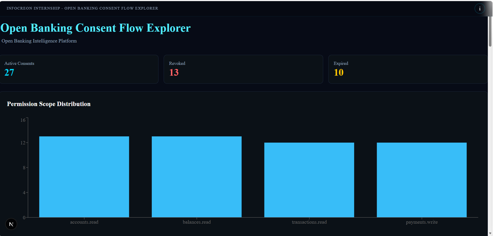

# Open Banking Consent Flow Explorer

Infocreon Internship – Cinematic Intelligence Platform for visualizing Open Banking consent management, permission scopes, token lifecycle events, audit workflows, and consent intelligence.

---

# Dashboard Preview



---

# Overview

Open Banking Consent Flow Explorer is a cinematic intelligence platform that visualizes how customer consent is managed within Open Banking ecosystems.

The platform provides operational visibility into:

* Consent status tracking
* Permission scope analytics
* Token lifecycle monitoring
* Consent revocation workflows
* Audit history
* Open Banking consent flow visualization

The application follows the Infocreon Cinematic Interface standard using a FastAPI backend and Next.js frontend.

---

# Technology Stack

## Frontend

* Next.js
* TypeScript
* Tailwind CSS
* shadcn/ui
* Recharts
* Axios

## Backend

* FastAPI
* Python
* Pandas

## Deployment

* Docker
* Docker Compose
* WSL2

---

# Data Sources

The project references publicly available Open Banking resources and uses synthetic data where event-level data is unavailable.

## Sources

* Open Banking UK
* Plaid Documentation
* TrueLayer Documentation

## Mock Data

* Synthetic user consent events
* Token refresh history
* Consent status records

---

# Features

## Permission Scope Analytics

Visualizes distribution of Open Banking permission scopes.

Examples:

* accounts.read
* balances.read
* transactions.read
* payments.write

---

## Consent Audit Log

Displays consent history including:

* Consent ID
* Bank
* Scope
* Status

Selecting a consent automatically opens the Dynamic Intelligence Panel.

---

## Token Expiry Simulator

Allows simulation of token lifetime.

Displays:

* Days remaining
* Expiry status
* Risk indicators

---

## Consent Revocation Workflow

Users can revoke consent and immediately observe:

* Status updates
* Metric updates
* Dashboard changes

---

## Dashboard Filters

Supports filtering by:

### Bank

* HSBC
* Barclays
* Lloyds
* Monzo
* Santander

### Status

* Active
* Expired
* Revoked

### Scope

* accounts.read
* balances.read
* transactions.read
* payments.write

---

## Download Sample Data

Exports currently filtered consent records as:

```json
consents.json
```

---

## Consent Flow Visualization

Illustrates the Open Banking data-sharing process:

```text
Customer
   ↓
Consent Granted
   ↓
Bank
   ↓
Aggregator
   ↓
Third Party App
```

---

# Cinematic Interface Layout

The application follows the Infocreon Cinematic Interface standard.

## Full-Screen Visualization Stage

* Metrics Cards
* Permission Scope Analytics
* Consent Flow Diagram
* Audit Log
* Consent Intelligence Visualizations

## Dynamic Intelligence Panel

The Intelligence Panel remains hidden until interaction occurs.

Provides:

* Why This Matters
* Who Controls The Rail
* Selected Consent Details
* Token Lifecycle Intelligence
* Dashboard Intelligence
* Filters
* Download Data

The panel slides into view when a consent record is selected and can be dismissed using the close action.

---

## Selenium End-to-End Testing

The deployed Azure application was validated using Selenium WebDriver.

### Automated Test Coverage

- Page Load Verification
- Dashboard Title Verification
- Metrics Cards Validation
- Permission Scope Chart Rendering
- Consent Flow Diagram Rendering
- Audit Log Verification
- Intelligence Panel Interaction
- Backend API Handshake Validation

### Test Result

All automated validation tests passed successfully.

**Status:** PASS

# Developer Signature

**Architect:** Gopika T P

**Batch:** Batch 3 Interns

### Technology Stack

* Next.js
* FastAPI
* Tailwind CSS
* Recharts
* shadcn/ui
* Docker

---

# System Architecture

```text
Frontend (Next.js)
        │
        ▼
FastAPI Backend
        │
        ▼
Mock Consent Dataset
        │
        ▼
Analytics + Visualizations
```

---

# API Endpoints

## Metrics

```http
GET /api/metrics
```

## Consent Records

```http
GET /api/consents
```

## Permission Scopes

```http
GET /api/scopes
```

## Token Analytics

```http
GET /api/token-analytics
```

---

# Project Structure

```text
POC-16-Open-Banking-Consent-Flow-Explorer-Gopika-phase2

├── backend/
│   ├── app/
│   ├── Dockerfile
│   └── requirements.txt
│
├── frontend/
│   ├── app/
│   ├── components/
│   ├── lib/
│   ├── public/
│   └── Dockerfile
│
├── screenshots/
├── selenium/
├── docker-compose.yml
├── README.md
├── VAR_REPORT.md
├── UAT_CHECKLIST.md
├── repomix-output.xml
└── .gitignore
```

---

# Local Setup

## Backend

```bash
cd backend
pip install -r requirements.txt
uvicorn app.main:app --reload
```

Runs on:

```text
http://localhost:8000
```

---

## Frontend

```bash
cd frontend
npm install
npm run dev
```

Runs on:

```text
http://localhost:3000
```

---

# Docker Deployment

## Prerequisites

* Docker Desktop
* Docker Compose
* WSL2 (Windows)

---

## Build and Run

```bash
docker compose up --build
```

---

## Access Application

### Frontend

```text
http://localhost:3000
```

### Backend API

```text
http://localhost:8000
```

### Swagger Documentation

```text
http://localhost:8000/docs
```

---

## Docker Services

### Frontend Container

* Next.js Application
* Port 3000

### Backend Container

* FastAPI Application
* Port 8000

### Network

* Docker Compose Network
* Internal Service Communication

---

# Docker Validation

The application was successfully validated using Docker Compose.

Verified Components:

* Frontend Container
* Backend Container
* Docker Network
* Swagger API Documentation
* API Connectivity
* Frontend ↔ Backend Communication

Verification URLs:

```text
http://localhost:3000
http://localhost:8000
http://localhost:8000/docs
```

All services were successfully built, started, and tested through Docker Compose deployment.

---

# Validation Documents

The project includes:

* VAR_REPORT.md
* UAT_CHECKLIST.md

These documents validate:

* Visualization quality
* Functional correctness
* API connectivity
* Dashboard interactions
* Docker deployment readiness

---

# Future Enhancements

* Real Open Banking provider integrations
* OAuth consent flow simulation
* Real-time token lifecycle monitoring
* Regulatory compliance insights
* Multi-bank consent analytics
* Live Open Banking event ingestion

---

# Author

**Gopika T P**

PoC #16 – Open Banking Consent Flow Explorer

Infocreon Internship – Batch 3 Interns
